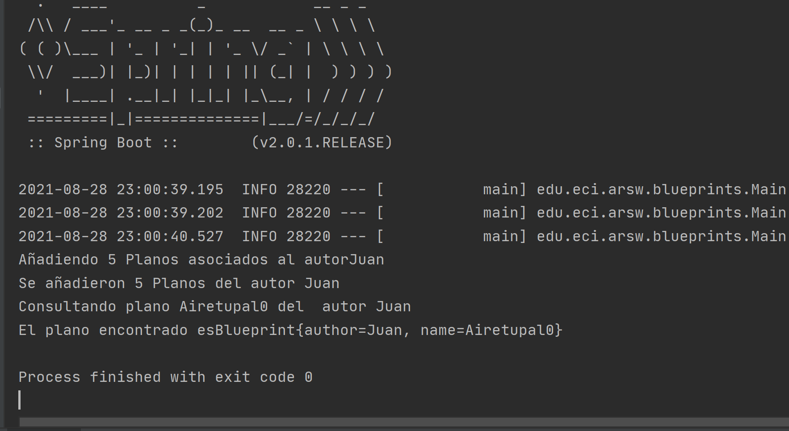

### Escuela Colombiana de Ingeniería

### Arquitecturas de Software
## Laboratorio Componentes y conectores  Middleware- gestión de planos

### Integrantes:

|     Nombre    |     Git         |
|--------------|------------- | 
| Camilo Rincón|[Rincon10](https://github.com/Rincon10 )  |
|Galeano Garzón |[Ersocaut](https://github.com/Ersocaut)   |


### Compilando el proyecto:
Para compilar el proyecto usaremos el siguiente comando
```
mvn package
```
### Ejecutando el proyecto:
Para hacer uso del proyecto debe haberlo compilado previamente , para ejecutarlo lo hacemos por medio de la consola usando el siguiente comando:
```
mvn exec:java -Dexec.mainClass="edu.eci.arsw.blueprints.Main"
```
O usar el comando
```
 mvn spring-boot:run
```


### Dependencias
* [Ejercicio introductorio al manejo de Spring y la configuración basada en anotaciones](https://github.com/ARSW-ECI-beta/DIP_DI-SPRING_JAVA-GRAMMAR_CHECKER).

### Descripción
En este ejercicio se va a construír un modelo de clases para la capa lógica de una aplicación que permita gestionar planos arquitectónicos de una prestigiosa compañia de diseño. 


### Parte I.

1. Configure la aplicación para que funcione bajo un esquema de inyección de dependencias, tal como se muestra en el diagrama anterior.

	Lo anterior requiere:

	* Agregar las dependencias de Spring, para que no exista ningun problema al momento de compilar y/o ejecutar se debe de agregar las siguientes dependencias al <b>pom.xml</b> .
	
	``` xml
    <dependencies>
            <dependency>
                <groupId>org.springframework</groupId>
                <artifactId>spring-core</artifactId>
                <version>5.1.3.RELEASE</version>
            </dependency>
            <dependency>
                <groupId>org.springframework</groupId>
                <artifactId>spring-context</artifactId>
                <version>5.1.3.RELEASE</version>
            </dependency>
            <dependency>
                <groupId>junit</groupId>
                <artifactId>junit</artifactId>
                <version>4.12</version>
            </dependency>
            <dependency>
                <groupId>org.springframework.boot</groupId>
                <artifactId>spring-boot-starter</artifactId>
            </dependency>
    </dependencies>
    ```
	
	* Agregar la configuración de Spring, para agregar los archivos de configuracion colocaremos el siguiente codigo en el archivo <b>nb-configuration.xml</b> .
	
	``` xml
    <?xml version="1.0" encoding="UTF-8"?>
    <project-shared-configuration>
        <!--
    This file contains additional configuration written by modules in the NetBeans IDE.
    The configuration is intended to be shared among all the users of project and
    therefore it is assumed to be part of version control checkout.
    Without this configuration present, some functionality in the IDE may be limited or fail altogether.
    -->
        <spring-data xmlns="http://www.netbeans.org/ns/spring-data/1">
            <config-files>
                <config-file>src/main/resources/applicationContext.xml</config-file>
            </config-files>
            <config-file-groups/>
        </spring-data>
    </project-shared-configuration>

    ```
	
	* Configurar la aplicación -mediante anotaciones- para que el esquema de persistencia sea inyectado al momento de ser creado el bean 'BlueprintServices'.
	
	Empezaremos definiendo los servicios, para esto a BlueprintsServices, le colocaremos la etiqueta Service
	``` java
    @Service
    public class BlueprintsServices {
    }
	```
 
    Ahora definiremos los componentes los cuales serán inyectados al servicio y les estableceremos un identificador a cada uno.
    
   ``` java
    @Component
    @Qualifier("InMemory")
    public class InMemoryBlueprintPersistence implements BlueprintsPersistence{
    } 
   ```
   
   Por último volveremos al servicio y le diremos que realice la inyección a un objeto específico con las siguientes etiquetas, en este caso dejaremos por defecto la persistencia <i><b>InMemoryBlueprintPersistence</b></i>.
   ``` java
       @Service
       public class BlueprintsServices {
           @Autowired
           @Qualifier("InMemory")
           BlueprintsPersistence bpp;
       }
   ```

2. Complete los operaciones getBluePrint() y getBlueprintsByAuthor(). Implemente todo lo requerido de las capas inferiores (por ahora, el esquema de persistencia disponible 'InMemoryBlueprintPersistence') agregando las pruebas correspondientes en 'InMemoryPersistenceTest'.

    Para completar estas operaciones simplemente se deben implementar los metodos en la clase <i><b>InMemoryBlueprintPersistence</b></i>.
    * <i><b>getBluePrint():</b></i>
        * Implementación: 
        ``` java
        @Override
        public Blueprint getBlueprint(String author, String bprintname) throws BlueprintNotFoundException {
            return blueprints.get(new Tuple<>(author, bprintname));
        }
        ```     
    * <i><b>getBlueprintsByAuthor():</b></i>
        * Implementación:
        ``` java
      @Override
      public Set<Blueprint> getBlueprintByAuthor(String author) throws BlueprintPersistenceException {
          Set<Blueprint> r = new HashSet<>();
          int cont = 0;
          for (Tuple<String, String> k : blueprints.keySet()){
              if (k.o1.equals(author)){
                  r.add(blueprints.get(k));
                  //System.out.println("El plano " + k.o2 + " es de la autoría de " + k.o1);
              }
          }
          return r;
      }
        ```
    * <i><b>Pruebas:</b></i>
   
    <br>
    
    <br>
     
3. Haga un programa en el que cree (mediante Spring) una instancia de BlueprintServices, y rectifique la funcionalidad del mismo: registrar planos, consultar planos, registrar planos específicos, etc.
    <br>
        
    <br>
    Ejecución del programa
    <br>
        
    <br>

4. Se quiere que las operaciones de consulta de planos realicen un proceso de filtrado, antes de retornar los planos consultados. Dichos filtros lo que buscan es reducir el tamaño de los planos, removiendo datos redundantes o simplemente submuestrando, antes de retornarlos. Ajuste la aplicación (agregando las abstracciones e implementaciones que considere) para que a la clase BlueprintServices se le inyecte uno de dos posibles 'filtros' (o eventuales futuros filtros). No se contempla el uso de más de uno a la vez:
	* (A) Filtrado de redundancias: suprime del plano los puntos consecutivos que sean repetidos.
	* (B) Filtrado de submuestreo: suprime 1 de cada 2 puntos del plano, de manera intercalada.

5. Agrege las pruebas correspondientes a cada uno de estos filtros, y pruebe su funcionamiento en el programa de prueba, comprobando que sólo cambiando la posición de las anotaciones -sin cambiar nada más-, el programa retorne los planos filtrados de la manera (A) o de la manera (B). 

### Referencias 
* Spring  [online] Available at: <https://www.arquitecturajava.com/spring-qualifier-utilizando-autowired/> [Accessed 28 August 2021].
* Execution SpringBoot [online] Available at: <https://www.baeldung.com/spring-boot-run-maven-vs-executable-jar> [Accessed 28 August 2021].
* Notaciones Spring  [online] Available at: <http://www.jtech.ua.es/j2ee/publico/spring-2012-13/sesion01-apuntes.html#Uso+de+anotaciones+Spring> [Accessed 28 August 2021].
